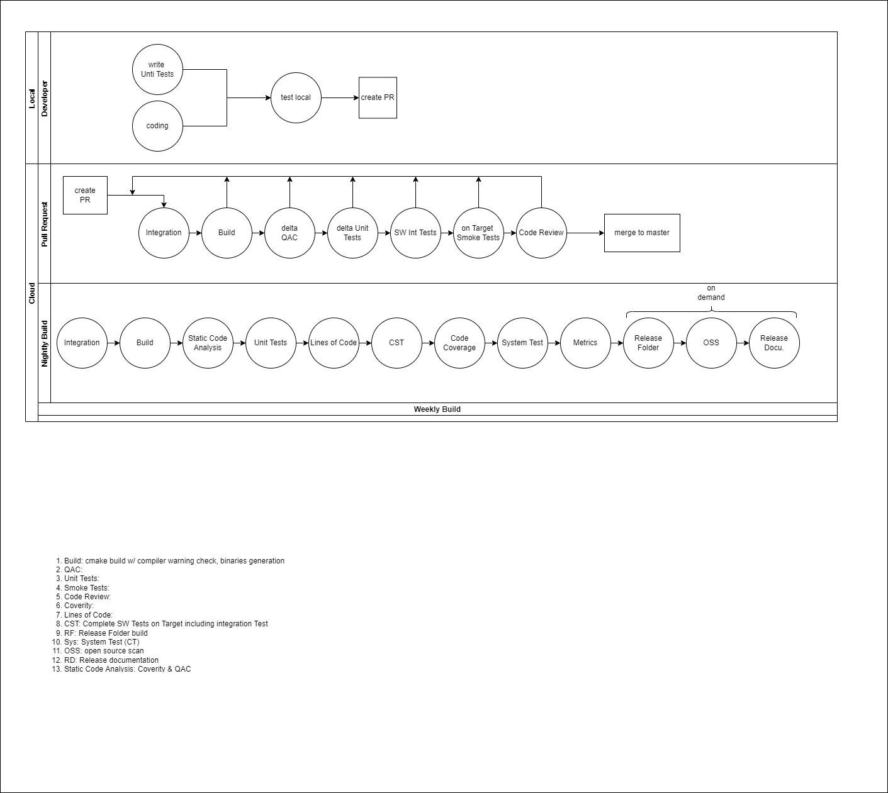

# How to use petalinux docker container

1. Install extensions Docker(ms-azuretools.vscode-docker) and Remote - Containers(ms-vscode-remote.remote-containers) in Visual Studio Code
2. Open the petalinux project folder via explorer
3. VS Code automatically detects a devcontainer and prompts re-opening inside a container. Select it
4. The petalinux project will be mounted in path /repo. Petalinux is installed in path /petalinux/2021.2
5. Before executing any petalinux commands please execute command in bash - "source /petalinux/2021.2/settings.sh"


# DevOps tool landscape


# Azure

## Resource groups

| Resource group | Subscription | Purpose |
| --------------- | --------| --------|
| lab000224-rg | BDC | Resource group to provide compute power and storage for the **uLRR** DevOps pipelines |
| lab000230-rg | BDC | Dashboard for test results |
| lab000244-rg | BDC | Resource group to provide compute power and storage for the **uLRR prototype** DevOps pipelines |
| lab000245-rg | BDC | Test resource group for the software developers |

## Azure access and permissions

| Lab | Permission | IDM Role |
| --------------- | --------| --------|
| lab000224 | Reader | IDM2BCD_RB_BoschDevCloud_lab000224_user |
| lab000230 | Reader | IDM2BCD_RB_BoschDevCloud_lab000230_user |
| lab000244 | Reader | IDM2BCD_RB_BoschDevCloud_lab000244_user |
| lab000245 | Reader | IDM2BCD_RB_BoschDevCloud_lab000245_user |

## Naming convention of Azure Resources

Use a hyphen to separate the different parts of the name.
Just use lower case in the names.

### Virtual Machine Scale Set

| Naming convention | Example  |
| ------------- | ----------------- |
| &lt;unique city name&gt;-&lt;hardware&gt;-vmss  | stuttgart-d2sv3-vmss   |

The name of a VMSS which is connected to an Agent pool in Azure DevOps should have the same name as the Agent pool.

### Virtual Machine

| Naming convention | Example  |
| ------------- | ----------------- |
| &lt;uniqe city name&gt;-&lt;purpose&gt;-(temp)-vm   | porto-ros-build-temp-vm or porto-ros-build-vm  |


The temp section is optional to mark VMs that just created for testing or development purpose

### Azure Compute Gallery

| Naming convention | Example  |
| ------------- | ----------------- |
| &lt;resource group name&gt;cg | zugspitzecg  |

One Azure Compute Gallery per resource group should be enough.

### Image Definition

| Naming convention | Example  |
| ------------- | ----------------- |
| &lt;base os&gt;-&lt;main tool&gt;-id   | ubuntu2004-docker-id  |


The name of the Image Definition must be the same as the name of the setup shell script to install the dependencies and configure the settings.

An image definition must contain the three attributes publisher, offer and SKU. Below you'll find Microsoft's definition.

**Publisher:** The organization that created the image. Examples: Canonical, MicrosoftWindowsServer \
**Offer:** The name of a group of related images created by a publisher. Examples: UbuntuServer, WindowsServer \
**SKU:** An instance of an offer, such as a major release of a distribution. Examples: 18.04-LTS, 2019-Datacenter

An example of how we fill out the fields:

| Attribute | Value | Example  |
| ------------- | ----------------- | ---------- |
| Publisher  | Company  | bosch |
| Offer  | Purpose  | swbuild |
| SKU  | Main tool and base os  | ubuntu2004-docker |


### VM Image Version

| Naming convention | Example  |
| ------------- | ----------------- |
| &lt;major&gt;.&lt;minor&gt;.&lt;patch&gt;   | 1.0.0  |


The VM Image Version should be synced with the version set in the setup shell script.

### Key Vault

| Naming convention | Example  |
| ------------- | ----------------- |
| &lt;target servie name&gt;-kv   | artifactory-docker-kv|

A Key Vault should only be used for one purpose.

### Storage Account

| Naming convention | Example  |
| ------------- | ----------------- |
| &lt;purpose&gt;st   | swbuildst |

A Storage Account should only be used for one purpose.

## Tags for Azure Resources

All created resources should contain the following tags (key/value pairs) to ensure how to handle it properly

| Key      | Value  | Required
| ----------- | --------- |--------- |
| Environment     |prod -> produce use <br>   dev -> for developing new features (add ticket ID to tag) <br>  test -> for a quick test delete after test |yes |
| Creator   |User ID of creator eq. lej1st  | yes |
| Owner  |User ID of owner eq. lej1st   | yes |
| Ticket   |Ticket ID   | no |

# Azure DevOps

## Azure Pipelines

### Pipeline structure

Basic structure which our pipelines should follow.

```

trigger:
  branches:
    include:
    - master

pr:
  branches:
    include:
    - master

pool:
  name:


variables:
- name: 
  value: 


stages:  # Stages are just required for multistage pipelines
- stage: A
  jobs:
  - job: A1
    steps:
    - bash: echo "A1a"
    - bash: echo "A1b"

  - job: A2
    steps:
    - bash: echo "A2"

- stage: B
  jobs:
  - job: B1
  - job: B2
```

### Naming convention for pipelines

Use a hyphen to separate the different parts of the name. Just use lower case in the names.
The name of the pipeline and the name of the Yaml file must be the same.

| Naming convention  | Pipeline name | Yaml file name |
| ------------------ | ------------- | -------------- |
| &lt;pipeline purpose&gt; | nightly-build  | nightly-build.yml  |

### Pipeline organization

Folder structure in Azure DevOps. A folder such as "Software Build" should be created for each purpose. This folder should contain all pipelines that belong to that purpose.

## Agent Pools

### Naming convention for agent pools

Use a hyphen to separate the different parts of the name. Just use lower case in the names.
The name of an agent which is connected to a VMSS should have the same name as the VMSS.

| Type      | Naming convention | Example  |
| ------------- | ----------------- | -------- |
| Self hosted   | &lt;purpose&gt;  | local-test-benches   |
| Azure virtual machine scale set | &lt;unique city name&gt;-&lt;hardware&gt;-vmss   |  stuttgart-d2sv3-vmss   |

### Name of the agent in an agent pool

The name of an agent in a self hosted agent pool should be the same name as the local computer name on which the agent will run. 

## Service connections

### Setup restrictions

To set up of a service connection a service user should be used.

### Naming convention for service connections

When creating a new service connection use the following pattern for the naming. Use a hyphen to separate the different parts of the name. 
Just use lower case in the names.

| Naming convention  | Example |
| ------------------ | ------------- |
| sc-&lt;source service name &gt;-&lt;target service name &gt; | sc-ado-artifactory |

## Azure DevOps project access and permissions

| Organisation | Permission | IDM Role |
| --------|  --------| --------|
| Zugspitze |  Contributor | IDM2BCD_BDC_AzureDevOps_org108_proj308_user  |
| Zugspitze |  Reader | assigned to everyone in L4 project   |

# Artifactory

## Repositories

| Repository | Purpose  |
| --------------- | --------|
| zugspitze-series-generic-local | For all general pipeline artifacts |
| zugspitze-series-conan-local | Includes Conan packages  |
| zugspitze-series-docker-local | Docker registry for Docker images |
| zugspitze-series-generic-share-local | Share for developers |

## Artifactory access and permissions

| Repository | Permission | IDM Role |
| --------------- | --------| --------|
| zugspitze-series-generic-local | Reader |  BDC_Artifactory_01_perm270_reader |
| zugspitze-series-conan-local | Reader |  BDC_Artifactory_01_perm270_reader |
| zugspitze-series-docker-local | Reader |  BDC_Artifactory_01_perm270_reader |
| zugspitze-series-generic-share-local | Write | BDC_Artifactory_01_perm438_user  |

## Naming convention of Artifactory repos

Use a hyphen to separate the different parts of the name. Just use lower case in the names.

| Naming convention  | Example |
| ------------------ | ------------- |
| zugspitze-series-&lt;repository type&gt;-local | zugspitze-series-generic-local  |

# Build Concept



