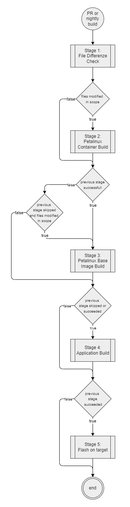
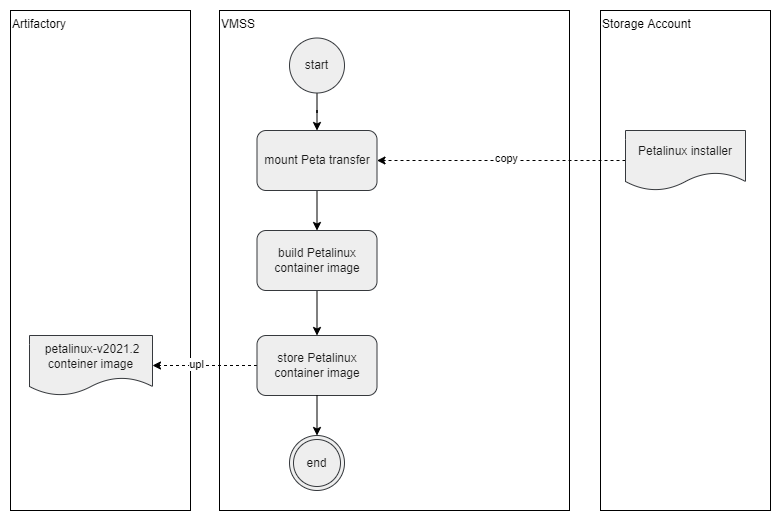
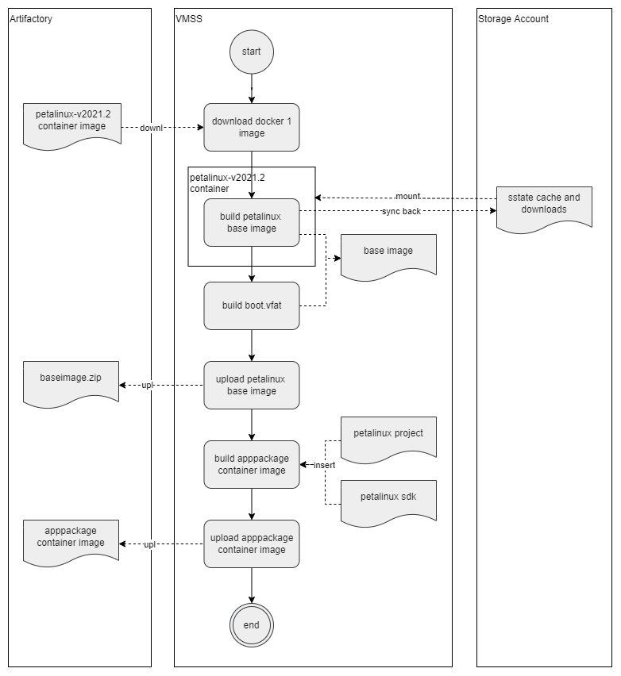
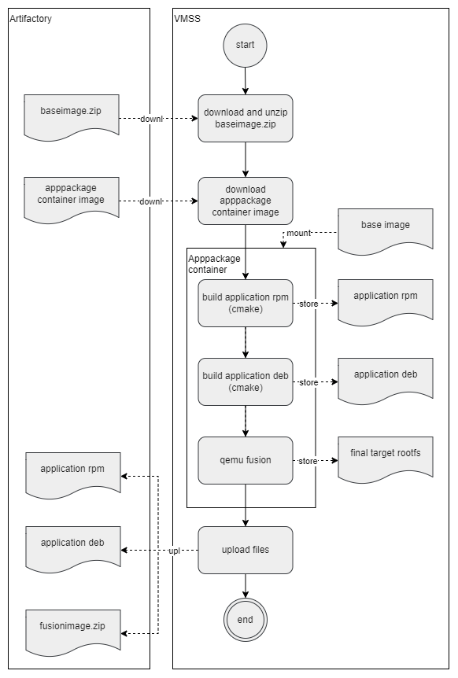
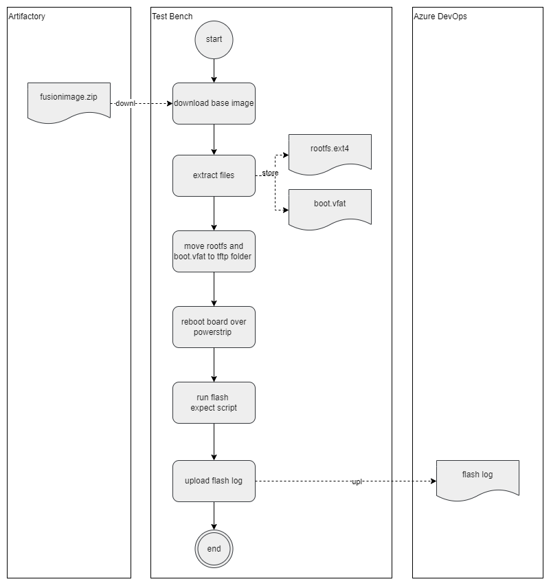
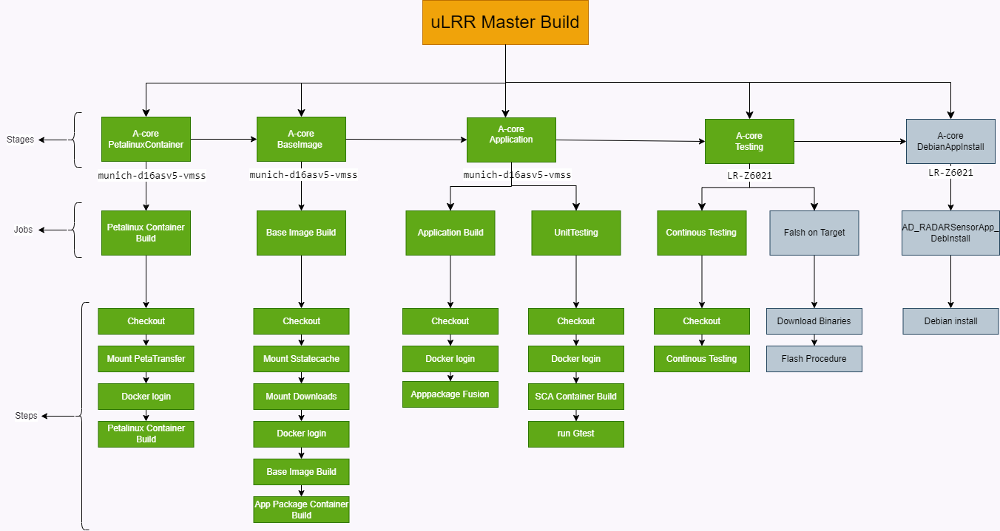

# A-Core pipeline flow

## A-Core Petalinux container build stage

## A-Core base image build stage

## A-Core application build stage

## A-Core on target stage

## ulrr master build pipeline
uLRR master build pipeline is scheduled for master branch every night at UTC 12:00:00 and triggered for any commit to master.
Latest master build image and sdk will be available for following day PR jobs
