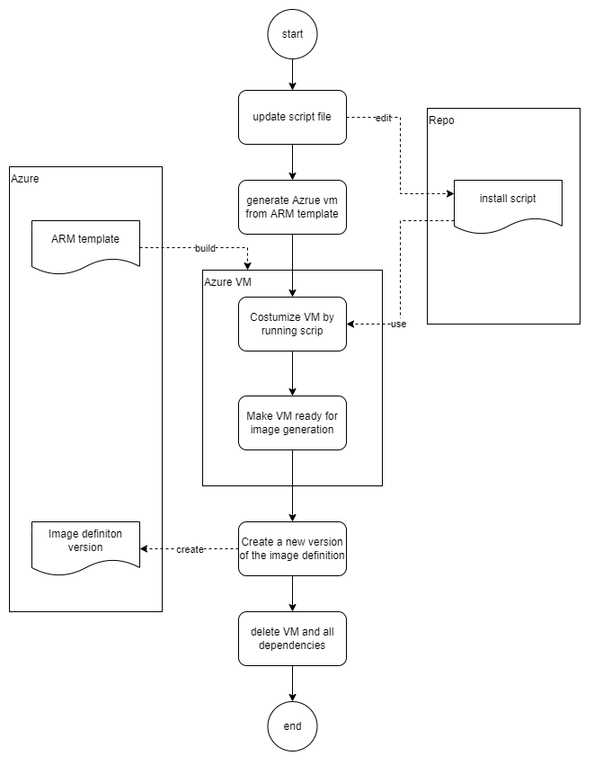
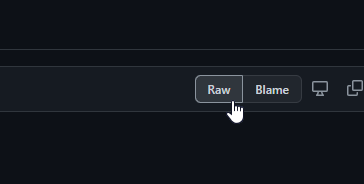

# Image scripts



## How to create an image in Azure for VMSS with the shell script

1. Update the shell script with your new features and set the script version no to the same as the new image version in Azure
2. Commit and push the new version of the script to GitHub</br>
   **!! Increase the version number by 1 based on the latest one and add the new version number at the beginning of the commit message !!**
3. Create a new virtual machine in Azure based on the Azure ARM template spec "raw-ubuntu20.04-vm-4-image-definition"</br>
   [→ Link to the ARM template](https://portal.azure.com/#@bosch.onmicrosoft.com/resource/subscriptions/f3e03797-77f9-4fe3-b659-cd072361b4fc/resourceGroups/lab000224-rg/providers/Microsoft.Resources/templateSpecs/raw-ubuntu20.04-vm-4-image-definition/overview)
4. Set the admin password for cis9lr user and deploy the template to create the VM
5. Connect to new VM "image-definition-temp-vm" via bastion
6. Go to the GitHub repo, click on view raw at the bash script and copy the URL in the browser</br>
   
7. Download the script to the VM

   ```bash
   curl <urlToTheScriptInGithub> -o <nameOfTheSciptFile>
   ```

   Example:

   ```bash
   curl https://raw.github.boschdevcloud.com/Half-Dome/ad-radar-sensor/feature/ATR-15428-shellscript-for-VM-image-and-testbench/tools/devops/scripts/ubuntu2004-generic-id.sh?token=GHSAT0AAAAAAAAAKUFOBWE6Q6VRA7USJBFEYZ3745 -o ubuntu2004-generic-id.sh
   ```

8. Execute the script to install all the packag
and do the settings
   - Note: If Vitis container is required, pass the flag "--vitis_required" and ensure VM has enough space required (at least 200GB - 98.74GB to download docker image into the machine and 98.3GB to load the same docker container locally)

    ```bash
    sudo bash <nameOfTheSciptFile> [--vitis_required]
    ```

   Example:

    ```bash
    sudo bash ubuntu2004-generic-id.sh
    ```

9. Generalize the VM with the following command

    ```bash
    sudo waagent -deprovision+user -force
    ```

10. Close the Bastion SSH session and shutdown the VM over the Azure portal
11. Open an Azure cloud shell in the browser
12. Deallocate the VM

    ```azurecli
    az vm deallocate --resource-group <myResourceGroup> --name <MyVM>
    ```

    Example:

    ```azurecli
    az vm deallocate --resource-group lab000224-rg --name image-definition-temp-vm
    ```

13. Mark the VM as Generalized

    ```azurecli
    az vm generalize --resource-group <myResourceGroup> --name <MyVM>
    ```

    Example:

    ```azurecli
    az vm generalize --resource-group lab000224-rg --name image-definition-temp-vm
    ```

14. Create a new version of the image definition</br>
    Increase the version number by 1 based on the latest one

    ```azurecli
    az sig image-version create --resource-group <myResourceGroup> \
    --gallery-name <MyGallery> --gallery-image-definition <MyImage> \
    --gallery-image-version <1.0.0> \
    --tags 'key=value' 'key=value' \
    --virtual-machine <resourceID>
    ```

    Example:

    ```azurecli
    az sig image-version create --resource-group lab000224-rg \
    --gallery-name zugspitzecg --gallery-image-definition ubuntu2004-generic-id \
    --gallery-image-version 1.0.0 \
    --tags 'owner=lej1st' 'creator=lej1st' 'environment=prod' \
    --virtual-machine /subscriptions/f3e03797-77f9-4fe3-b659-cd072361b4fc/resourceGroups/lab000224-rg/providers/Microsoft.Compute/virtualMachines/image-definition-temp-vm
    ```

15. Create a new VMSS or assign the new version to an existing VMSS in the portal
